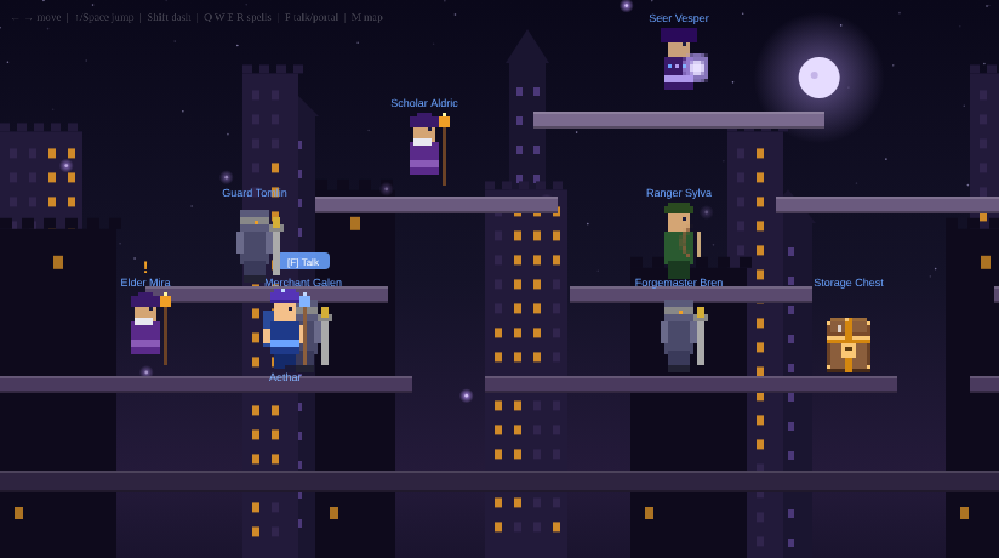

# ⭐ AstralBound

> A self-contained, pixel-art 2D platformer RPG that runs entirely in your browser — no build step, no dependencies, no asset files. The whole game is one `index.html`.

Play a lone mage in the fractured world of **Aethoria**, hunting the source of the Hollow Rift across five zones of hand-tuned platforming and spell combat, all the way to a final confrontation with the corrupted Oracle Veyra.



---

## ▶️ Play

Just open the file — there is nothing to install.

```bash
# macOS
open index.html
# Linux
xdg-open index.html
# …or serve it locally
python3 -m http.server 8080   # then visit http://localhost:8080
```

Every sprite, sound, and music track is **generated at runtime** (Canvas 2D + the Web Audio API), so the game is a single ~2,000-line HTML document with zero external requests.

## 🎮 Controls

| Action | Keyboard | Touch |
|---|---|---|
| Move | `←` `→` | on-screen pad |
| Jump | `↑` / `Space` | ⬆ button |
| Dodge dash (i-frames) | `Shift` | ⤢ button |
| Cast spells | `Q` `W` `E` `R` | tap a monster |
| Use potions | `T` `Y` | hotbar slots |
| Talk / take portal | `F` | 💬 button |
| World map | `M` | 🗺 button |

Touch controls appear automatically on phones and tablets.

## ✨ Features

- **A continuous story in 15 quests** — the Hollow Rift arc, told by a cast of NPCs in the city hub. Each combat zone has a rare-relic hunt and a boss-kill quest, building to a level-gated finale.
- **Six zones** — Aethon City (safe hub), Village Outskirts, Verdant Forest, Crystal Caverns, Ancient Ruins, and the teleport-only **Hollow Rift**.
- **Spellcasting & a skill tree** — Arcane Bolt, Fireball, Ice Shard, and Mana Shield, deepened by skills like Pyromancy, Deep Frost, Arcane Surge (crits), and Greater Ward.
- **Loot that matters** — procedural gear across six rarity tiers, unique boss-only **Artifacts** with special powers (lifesteal, haste, mana regen, thorns), and a forge to upgrade your finds.
- **Dangerous enemies** — six monster types plus **elite affixes** (frenzied, vampiric, explosive, armored) and bosses that **enrage** the longer you drag out the fight.
- **A dodge dash** with invulnerability frames for skill-based survival against bullet-hell boss patterns.
- **Repeatable bounties, an expandable storage chest, and a potion hotbar.**
- **Automatic saves** to `localStorage` — close the tab and pick up where you left off.

## 🛠️ How it works

Everything lives in `index.html`, organized into inline sections:

| Section | Responsibility |
|---|---|
| Audio Engine | Procedural music & SFX via Web Audio (no audio files) |
| Cutscene System | Narrative scenes rendered to Canvas 2D |
| Sprite System | Pixel sprites generated at runtime (no images) |
| Game Engine | State, physics, combat, quests, skills, the main loop |

All mutable state lives on a single `G` object; rendering is multi-layer parallax Canvas 2D; audio is synthesized from oscillators and noise. See [`CLAUDE.md`](CLAUDE.md) for a full architecture tour.

## ✅ Tests & CI

Game logic is covered by a [Playwright](https://playwright.dev) suite that boots `index.html` in headless Chromium and drives the real game functions and state — 60+ checks across boot/persistence, zones, monsters & affixes, combat, skills, gear & forge, all 15 quests, economy, bosses & enrage, and dash/i-frames.

```bash
npm install
npx playwright install --with-deps chromium
npm test
```

CI runs the suite on every pull request and push to `main` (`.github/workflows/tests.yml`).

## 📁 Project structure

```
index.html      # the entire game
tests/          # Playwright suite (one spec per domain) + README
docs/           # screenshot used by this README
CLAUDE.md       # architecture & content reference
```

## 🤝 Contributing

All game code stays in the single `index.html`; new content (monsters, items, spells, quests) goes next to its existing counterparts as data. When you add or change a system, add or update the matching `tests/*.spec.js` so the suite stays a complete content inventory. Conventions are documented in [`CLAUDE.md`](CLAUDE.md).
